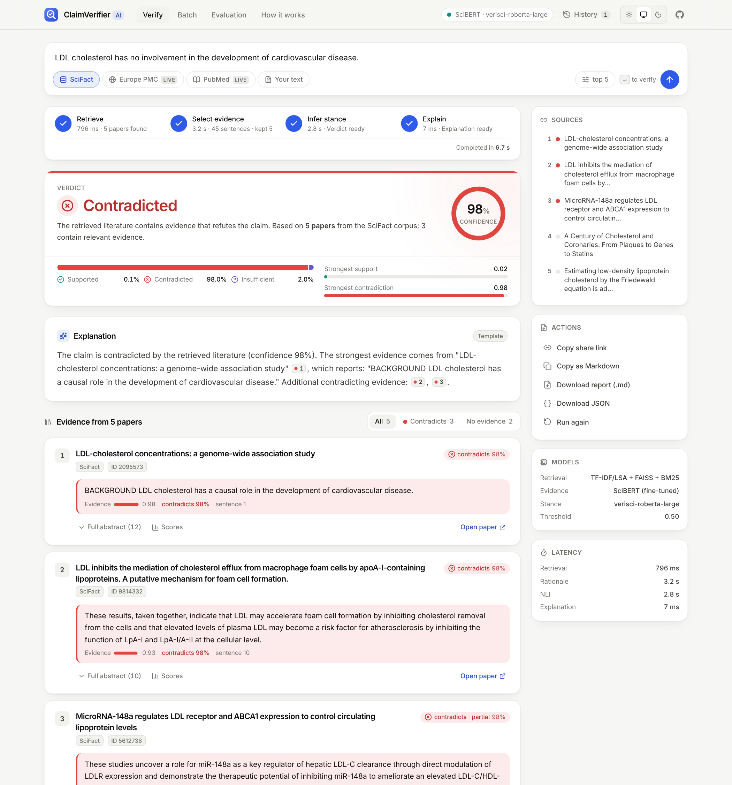
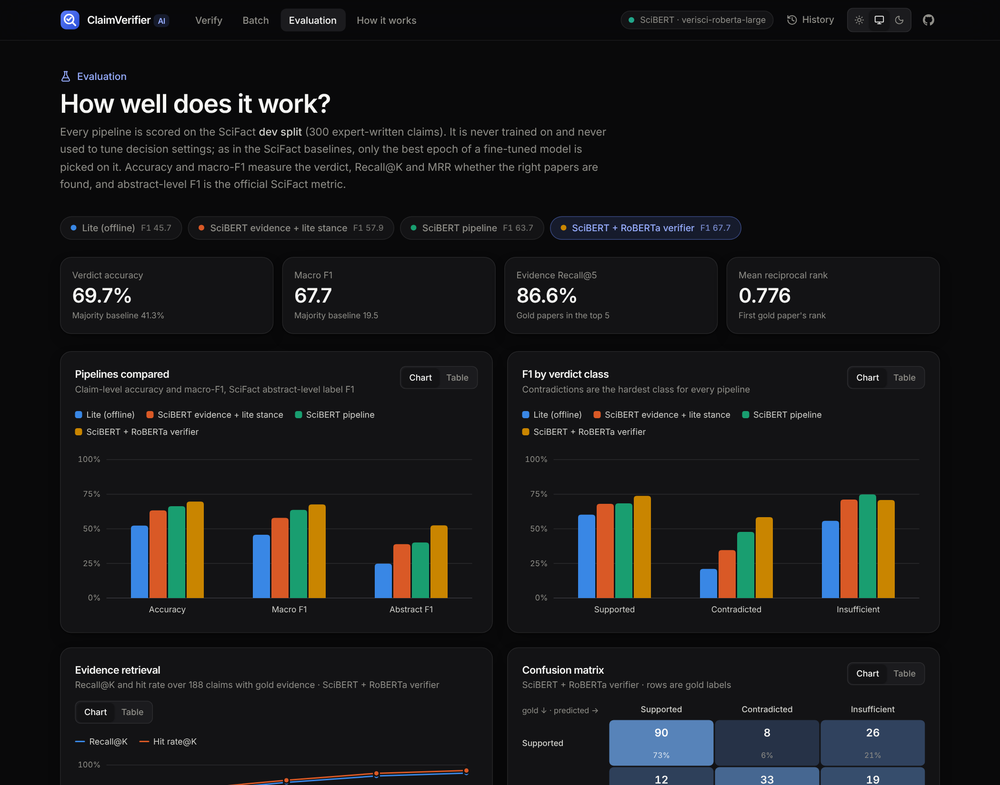
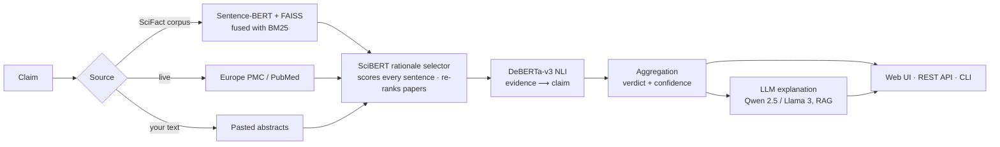

# ClaimVerifier AI

**Check any scientific claim against the research literature.** ClaimVerifier retrieves relevant papers, highlights
the sentences that act as evidence, and classifies the claim as **Supported**, **Contradicted** or **Insufficient
Evidence** with confidence scores. It then writes a short explanation that cites its sources. Every verdict can be
traced back to specific sentences in specific papers.



| | |
|---|---|
|  |  |

It is built on the open **[SciFact](https://github.com/allenai/scifact)** dataset (Wadden et al., EMNLP 2020): 5,183
research abstracts and 1,409 expert-written claims annotated with SUPPORT / CONTRADICT labels and rationale sentences.
It can also search live abstracts through Europe PMC and PubMed, or check a claim against text you paste in.

## Highlights

- **Web app** (React + TypeScript + Tailwind). The pipeline runs stage by stage on screen, and explanations stream in
  token by token. Hovering a citation chip highlights the paper it cites. Evidence sentences are colour-coded by stance,
  and each full abstract has an evidence heatmap. The app also includes:
  - batch verification, with accuracy and macro-F1 when you supply gold labels;
  - claim extraction from a pasted article;
  - an evaluation dashboard;
  - history, share links, and Markdown/JSON export;
  - light and dark themes.
- **Transparent NLP pipeline:**
  - Sentence-BERT + FAISS, fused with BM25, finds the papers.
  - SciBERT selects evidence sentences and can re-rank papers by them.
  - DeBERTa-v3 NLI decides the stance.
  - A relevance-gated aggregator produces the verdict and confidence scores.
  - Llama 3 / Qwen 2.5 explain the verdict with retrieval-augmented generation.
- **Live literature search** through Europe PMC and PubMed, plus a "your text" mode for any abstract.
- **Streaming REST API** (FastAPI, server-sent events), with interactive docs at `/docs`.
- **Measured, not guessed:** accuracy, precision, recall, F1, Recall@K, MRR and the official SciFact abstract-level F1,
  all on a held-out split. A plain-language robustness probe catches models that only learned dataset quirks. The
  reports are browsable in the UI.
- **Runs anywhere:** one `pip install`, a Docker image, or a fully offline CPU configuration with no model downloads.

## Architecture



1. **Retrieval.** Claim and abstracts are embedded with Sentence-BERT and searched with a FAISS inner-product index.
   The dense ranking is fused with BM25 using reciprocal-rank fusion. Live mode queries Europe PMC or PubMed instead;
   structured abstracts are parsed and sentence-split.
2. **Evidence selection.** A SciBERT cross-encoder fine-tuned on SciFact scores every `(claim, sentence)` pair. With
   `retrieval.rerank_depth` set, more candidates are retrieved and the ones with the strongest evidence are kept.
3. **Natural language inference.** The selected evidence is the premise and the claim is the hypothesis. Entailment
   maps to Supported, contradiction to Contradicted, and neutral to Insufficient Evidence. The model is DeBERTa-v3, or a
   fine-tuned SciBERT verifier.
4. **Aggregation.** Each paper is weighted by its evidence relevance, `g = min(1, r / τ)`. The strongest weighted
   support `S` and contradiction `C` combine as:
   - `P(Supported) ∝ S(1−C) + share of SC`
   - `P(Contradicted) ∝ C(1−S) + share of SC`
   - `P(Insufficient) ∝ w·(1−S)(1−C)`

   The three scores sum to one. Strong evidence in both directions is flagged as *mixed*. `τ` and `w` can be calibrated
   on the train split.
5. **Explanation (RAG).** An instruction-tuned LLM explains the verdict using only the numbered evidence, citing it as
   `[n]`. Citations to sources that don't exist are removed. The verdict always comes from the NLI pipeline, never from
   the LLM. Without an LLM, a deterministic extractive explanation with citations is used instead.

## Quick start

```bash
python -m venv .venv && source .venv/bin/activate
pip install -r requirements.txt                       # or requirements-lite.txt for the offline stack

python -m claimverifier setup --config configs/default.yaml   # download SciFact, build the index, train fallbacks
python -m claimverifier serve --config configs/default.yaml   # → http://localhost:8000
```

The built web UI ships inside the Python package, so Node.js is only needed to work on the frontend.

### Configurations

| Config | Retrieval | Evidence selection | Verification | Explanation | Needs |
|---|---|---|---|---|---|
| `lite.yaml` | BM25 (+ LSA in FAISS) | logistic regression on features | lexical stance model | template | CPU only, no downloads |
| `scibert.yaml` | BM25 (+ LSA in FAISS) | **SciBERT** (fine-tuned) | **SciBERT** verifier (fine-tuned) | template | SciBERT download |
| `verisci.yaml` | BM25 (+ LSA in FAISS) | **SciBERT** (fine-tuned) | **RoBERTa-large** verifier (FEVER + SciFact) | Qwen 2.5, or template | SciBERT + S3 download; **best measured** |
| `default.yaml` | **Sentence-BERT** + FAISS + BM25 | **SciBERT** (fine-tuned) | **DeBERTa-v3** NLI | **Qwen2.5-1.5B-Instruct** | Hugging Face downloads |
| `large.yaml` | mpnet SBERT + FAISS + BM25 | SciBERT | DeBERTa-v3-large NLI | Llama-3-8B-Instruct | GPU ≥ 16 GB |

Fine-tune the SciBERT components. Each takes minutes on a GPU, or about an hour on a CPU.

```bash
python -m claimverifier train-rationale --config configs/default.yaml --neg-ratio 4 --lr 3e-5
python -m claimverifier train-nli --config configs/default.yaml --retrieval-negatives 2   # optional for DeBERTa
python -m claimverifier calibrate --config configs/default.yaml --split train
python -m claimverifier evaluate  --config configs/default.yaml --split dev
```

For the best pipeline measured here, run `python -m claimverifier fetch-verifier` and use `configs/verisci.yaml`
(`setup --no-calibrate`, then `train-rationale`). For the SciBERT-only pipeline, use `configs/scibert.yaml` with the same
commands. There, `train-nli` fine-tunes SciBERT
as a 3-way verifier; add `--lr 3e-5 --batch-size 16 --grad-accum 1`. `--augment` adds direction-flipped and
paraphrased claims to the training data (see [Results](#results)).

### LLM backends for explanations

| `explanation.backend` | Model | Notes |
|---|---|---|
| `transformers` (default) | `Qwen/Qwen2.5-1.5B-Instruct` | Local, CPU or GPU, no login |
| `transformers` | `meta-llama/Meta-Llama-3-8B-Instruct` | Gated: accept the license and `huggingface-cli login` |
| `ollama` | `llama3.1:8b`, `qwen2.5:7b`, … | `ollama pull llama3.1:8b`, then `--set explanation.backend=ollama` |
| `openai` | anything served by vLLM, llama.cpp, LM Studio, TGI | `--set explanation.backend=openai --set explanation.openai_base_url=http://host:8000/v1` |
| `template` | none | Deterministic extractive explanation with citations |

All backends stream tokens to the UI. Any config value can be overridden on the command line, for example
`--set retrieval.top_k=8 --set retrieval.rerank_depth=10`.

### Docker

```bash
docker compose run --rm setup     # one-off: data, index, fallbacks, calibration
docker compose up app             # http://localhost:8000
```

The image builds the web UI in a Node stage and serves it from the same FastAPI process.

## Results

All numbers are on the **SciFact dev split**: 300 claims (124 Supported, 64 Contradicted, 112 Insufficient Evidence).
Models never train on it, and decision settings are never tuned on it. As in the SciFact baselines, only the best epoch
of a fine-tuned SciBERT model is chosen on dev claim–evidence pairs. Full reports (per-class scores, confusion
matrices, predictions) are in [`reports/`](reports) and on the **Evaluation** page.

These runs come from a CPU-only environment where the Hugging Face Hub was not reachable. SciBERT and the SciFact
authors' RoBERTa verifier were available from AI2's S3 bucket, but Sentence-BERT, DeBERTa-v3 and Qwen/Llama were not.
So the `default` and `large` configurations are not benchmarked here; run `make evaluate` to add them.

### Claim verification

| Pipeline (config) | Evidence selection | Verification | Accuracy | Macro P | Macro R | **Macro F1** | Contradicted F1 | Abstract F1 (label / rationalized) |
|---|---|---|---|---|---|---|---|---|
| Majority class (always *Supported*) | – | – | 41.3 | 13.8 | 33.3 | 19.5 | 0.0 | – |
| `lite` (offline, calibrated on train) | logistic regression | lexical stance model | 52.3 | 47.2 | 46.5 | 45.7 | 21.1 | 24.8 / 21.6 |
| `scibert` + lexical stance | **SciBERT** | lexical stance model | 63.3 | 60.6 | 57.7 | 57.9 | 34.6 | 38.9 / 35.5 |
| `scibert` | **SciBERT** | SciBERT verifier | 66.3 | 63.8 | 64.1 | 63.7 | 47.8 | 40.1 / 36.6 |
| **`verisci`** | **SciBERT** | **RoBERTa-large (FEVER + SciFact)** | **69.7** | **69.3** | **67.0** | **67.7** | **58.4** | **52.5 / 48.9** |

The `verisci` verifier was trained by the SciFact authors on FEVER and SciFact train (`claimverifier fetch-verifier`
downloads it). In this pipeline it works behind our SciBERT evidence selector and BM25 retrieval.

### Robustness: plain-language stance probes

Benchmark scores can hide models that learned dataset quirks. `python -m claimverifier probe` runs 24 hand-written
pairs (12 supported, 12 contradicted) that differ only in effect direction, negation or paraphrase. Example: evidence
"Aspirin reduced the risk of colorectal cancer by 23%" with the claims "Aspirin reduces…" and "Aspirin increases…".

| Verifier | Probes correct | SciFact dev macro-F1 (pipeline) |
|---|---|---|
| Lexical stance model (`lite`) | 20 / 24 (83%) | 45.7 |
| SciBERT verifier, fine-tuned on SciFact (`scibert`) | 14 / 24 (58%) | 63.7 |
| SciBERT verifier + direction augmentation (`train-nli --augment`) | 10 / 24 (42%) | 65.8 |
| **RoBERTa-large, FEVER + SciFact (`verisci`)** | **24 / 24 (100%)** | **67.7** |

SciBERT fine-tuned on about 3k SciFact pairs scores reasonably on dev, but it gets everyday phrasings wrong; for
example, it rates "reduced the risk" as contradicting "reduces the risk". Augmenting its training data with flipped and
paraphrased claims raised dev macro-F1 by 2.1 points but made the probes *worse*, so it is not used by default. A
verifier pretrained on large fact-checking data fixes both. That is why `default.yaml` uses DeBERTa-v3
(MNLI/FEVER/ANLI) and falls back to the RoBERTa verifier when offline.

### Evidence retrieval (188 dev claims with gold evidence abstracts)

| Retriever | Recall@1 | Recall@3 | Recall@5 | Recall@10 | Recall@20 | MRR |
|---|---|---|---|---|---|---|
| LSA dense embeddings + FAISS | 40.4 | 54.0 | 66.9 | 76.5 | 84.6 | 0.532 |
| LSA + BM25, reciprocal-rank fusion | 55.4 | 68.8 | 78.7 | 85.3 | 91.0 | 0.661 |
| **BM25** (used by `lite` / `scibert` / `verisci`) | 69.0 | 80.1 | 86.6 | 91.6 | 93.8 | 0.776 |
| BM25 top 10 → **SciBERT re-ranking** (top 5 kept) | **72.7** | **84.4** | **88.0** | – | – | 0.804 @5 |

LSA vectors are too coarse to help BM25 on SciFact, so their fusion weight was set to 0 using the train split.
`default.yaml` fuses BM25 with much stronger Sentence-BERT embeddings. Re-ranking by SciBERT evidence scores
(`--set retrieval.rerank_depth=10`) finds more gold papers, but the verdict does not improve: macro-F1 is 67.5 with
`verisci`. It is therefore off by default for the corpus and always on for live Europe PMC / PubMed results, whose own
ranking is keyword-based.

### Components

* **SciBERT rationale selector:** sentence-level F1 0.691 (P 0.698, R 0.683) on dev evidence and cited abstracts. It was
  trained for 2 epochs (about 1 h on a 3-thread CPU) with negatives down-sampled to 4:1.
* **SciBERT verifier** (3-way, dev claim–evidence pairs including retrieved hard negatives): accuracy 81.1%, macro-F1
  0.706. With augmentation: 83.0%, 0.725.
* **Latency on 4 CPU threads:** `verisci` takes about 6–7 s per claim for 5 abstracts, mostly SciBERT sentence scoring
  and RoBERTa-large inference (a GPU is recommended for interactive use). `lite` takes about 50 ms.

## REST API

| Endpoint | Description |
|---|---|
| `POST /api/verify` | `{claim, top_k?, explain?, source?: corpus \| europepmc \| pubmed \| custom, documents?}` → verdict, scores, papers with evidence, explanation |
| `POST /api/verify/stream` | Same request, streamed as server-sent events |
| `POST /api/verify/batch` | Up to 64 claims |
| `POST /api/claims/extract` | `{text}` → check-worthy claims found in an article |
| `GET /api/search?q=` | Search the indexed corpus |
| `GET /api/documents/{id}` | One abstract |
| `GET /api/examples` | Labelled SciFact dev claims |
| `GET /api/reports`, `/api/reports/{name}` | Evaluation reports |
| `GET /api/info`, `/api/health` | Loaded components, dataset stats, available sources |

The stream sends these events, in order:

1. `stage`: start and done of `retrieval`, `rationale`, `nli` and `explanation`, with timings.
2. `candidates`: the papers found.
3. `result`: the verdict and evidence.
4. `token`: explanation chunks. A `reset` event means the LLM failed and the template took over.
5. `explanation`: the final text with checked citations.
6. `done`, or `error` if something went wrong.

```bash
curl -N -X POST localhost:8000/api/verify/stream -H 'Content-Type: application/json' \
     -d '{"claim": "Statins reduce major cardiovascular events.", "source": "pubmed"}'
```

Identical requests are answered from an in-memory cache. Set `NCBI_API_KEY` for higher PubMed rate limits.

## Evaluation metrics

`python -m claimverifier evaluate --config <config> --split dev` writes `metrics.json`, `predictions.jsonl` and
`report.md` to `reports/<name>_dev/`, which the **Evaluation** page shows.

* **Verdict classification** (claim level, 3 classes): accuracy; per-class, macro and weighted precision, recall and F1;
  and the confusion matrix. A claim's gold label is Supported or Contradicted if it has annotated evidence, and
  Insufficient Evidence otherwise.
* **Evidence retrieval** (claims with gold evidence):
  - **Recall@K**: share of gold evidence abstracts in the top K.
  - Hit@K and Precision@K.
  - **MRR**: mean of 1 / rank of the first gold abstract.
* **SciFact abstract-level evaluation:** a predicted supporting or contradicting abstract is correct if it is gold
  evidence with the same label (*label-only*). The *rationalized* variant also requires its highlighted sentences to
  contain a full gold rationale. Sentence-level selection P/R/F1 is reported too.

Calibration and all decision settings use the **train** split. `python -m claimverifier probe --config <config>` runs
the 24 plain-language stance probes against the configured NLI model.

## Development

```bash
make serve                         # backend on :8000 (serves the built UI)
make web-install && make web-dev   # hot-reloading UI on :5173, proxied to the backend
make web-build                     # rebuild claimverifier/web/dist
make test                          # pytest (tiny local models for transformer paths) + vitest
```

```
claimverifier/
  data/scifact.py        SciFact download (safe extraction) and loading
  retrieval/             Sentence-BERT / LSA embedders, FAISS index, BM25, hybrid retriever
  rationale.py           Evidence selection: SciBERT / learned features / zero-shot similarity
  nli.py                 Transformer NLI (label names auto-mapped) and the lite stance model
  aggregation.py         Claim-level verdict and confidence
  explain.py             RAG prompt, streaming LLM backends, template fallback
  sources.py             Live Europe PMC and PubMed search
  text.py                Sentence splitting, abstract cleaning, claim extraction
  pipeline.py            ClaimVerifier: batch and streaming verification, re-ranking
  training/              Example builders, augmentation, fine-tuning loop, lite models
  evaluation/            Metrics, evaluation reports, calibration
  api.py · cli.py        FastAPI service (+ web UI) and command-line interface
  web/dist/              Built web UI (generated from web/)
web/src/                 React app: pages/, components/, charts/, hooks/, lib/
configs/                 lite · scibert · default · large
reports/                 Evaluation reports shown in the UI
tests/                   pytest suite on a bundled mini SciFact corpus
```

### Using your own corpus

Point `data.corpus_path` at a JSONL file with one `{"doc_id": int, "title": str, "abstract": [sentences] | str}` object
per line. Plain-text abstracts are sentence-split automatically. Then rebuild the index with
`python -m claimverifier index --config <config>`.

## Limitations

* *Insufficient Evidence* means the retrieved papers do not settle the claim, not that it is false.
* The models judge whether abstracts entail the claim. They do not assess study quality, sample size or publication
  bias. Treat the output as a research aid, not medical advice, and read the cited papers.
* Contradictions are the hardest class for every pipeline measured here.
* Live search depends on the Europe PMC and PubMed APIs being reachable; the indexed corpus works offline.

## Dataset and license

SciFact is released by the Allen Institute for AI under **CC BY-NC 2.0** (non-commercial use). It is downloaded at setup
time and not redistributed here. If you use it, please cite:

```bibtex
@inproceedings{wadden-etal-2020-fact,
  title     = {Fact or Fiction: Verifying Scientific Claims},
  author    = {Wadden, David and Lin, Shanchuan and Lo, Kyle and Wang, Lucy Lu and van Zuylen, Madeleine and Cohan, Arman and Hajishirzi, Hannaneh},
  booktitle = {Proceedings of EMNLP},
  year      = {2020}
}
```
