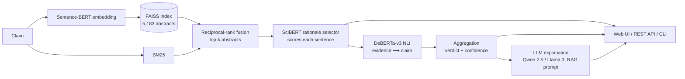

# ClaimVerifier AI — Scientific Claim Verification with NLP and Retrieval-Augmented Generation

ClaimVerifier AI checks a scientific claim against the research literature. You enter a claim; the system
**retrieves relevant research abstracts**, **highlights the sentences that act as evidence**, **classifies the
claim as _Supported_, _Contradicted_ or _Insufficient Evidence_** with **confidence scores**, and writes a
**concise explanation with citations**.

Unlike a search engine that only lists related papers, it combines semantic retrieval, scientific
natural-language inference and LLM-generated explanations into a transparent, evidence-based verdict:
every decision can be traced back to specific sentences in specific papers.

It is built on the open **[SciFact](https://github.com/allenai/scifact)** dataset (Wadden et al., EMNLP 2020):
5,183 research abstracts and 1,409 expert-written claims annotated with SUPPORT / CONTRADICT labels and
rationale sentences.

| Component | Model / technique | Role |
|---|---|---|
| Semantic retrieval | **Sentence-BERT** (`all-MiniLM-L6-v2`) + **FAISS** | Dense vector search over the abstract corpus |
| Lexical retrieval | **BM25**, fused with reciprocal-rank fusion | Hybrid search (exact terms, numbers, gene names) |
| Evidence selection | **SciBERT** cross-encoder fine-tuned on SciFact | Scores every sentence of a retrieved abstract as evidence or not |
| Verification | **DeBERTa-v3** NLI (MNLI/FEVER/ANLI, optionally fine-tuned on SciFact) | Does the evidence entail, contradict, or not address the claim? |
| Aggregation | Relevance-gated evidence combination | Claim-level verdict and confidence scores |
| Explanation (RAG) | **Qwen 2.5 Instruct** or **Llama 3 Instruct** | Short explanation grounded in the evidence, with `[n]` citations |
| Evaluation | Accuracy, Precision, Recall, F1, **Recall@K**, **MRR**, SciFact abstract-level F1 | Retrieval and verification quality |

An **offline "lite" pipeline** (TF-IDF/LSA + FAISS + BM25 retrieval, scikit-learn evidence and stance models,
template explanations) runs with no PyTorch and no model downloads. Every transformer component also falls back
to its lite counterpart automatically if it is unavailable.

---

## Architecture



1. **Retrieval.** Claim and abstracts (title + text) are embedded with Sentence-BERT and searched with a
   FAISS inner-product index (exact `flat` by default; `hnsw` / `ivf` for large corpora). The dense ranking is
   fused with a BM25 ranking using reciprocal-rank fusion (RRF), which is robust to their different score scales.
2. **Rationale selection.** For each of the top-k abstracts, a SciBERT cross-encoder scores every
   `(claim, sentence)` pair. Up to 3 sentences above the threshold become the abstract's evidence (if none
   passes, the best sentence is kept as weak evidence).
3. **Natural language inference.** DeBERTa-v3 reads `premise = evidence sentences`, `hypothesis = claim`, and
   outputs entailment / contradiction / neutral probabilities, which map to Supported / Contradicted /
   Insufficient. It also runs per sentence to colour each highlighted sentence by stance.
4. **Aggregation.** Each abstract is weighted by its evidence relevance, `g = min(1, r / τ)`, where `r` is the
   best rationale score and `τ` the threshold. The strongest weighted support `S = max g·p(support)` and contradiction
   `C = max g·p(contradict)` are combined as two independent detectors:
   `P(Supported) ∝ S(1−C) + share of SC`, `P(Contradicted) ∝ C(1−S) + share of SC`,
   `P(Insufficient) ∝ w·(1−S)(1−C)`. The three scores sum to one and serve as the confidence scores; conflicting
   strong evidence is flagged as *mixed*. The threshold `τ` and the weight `w` can be tuned with `calibrate`.
5. **Explanation (RAG).** The verdict, confidence and numbered evidence sentences are put into a prompt for an
   instruction-tuned LLM, which must explain the verdict using only that evidence and cite sources as `[n]`.
   Citations to non-existent sources are removed; if the LLM is unavailable, a deterministic extractive
   explanation with citations is produced instead.

---

## Quick start

### 1. Install

```bash
python -m venv .venv && source .venv/bin/activate
pip install -r requirements.txt          # full stack (PyTorch, transformers, sentence-transformers, FAISS)
# or: pip install -r requirements-lite.txt   # offline lite stack, no PyTorch
```

Python 3.9+ is supported. A GPU is optional; it speeds up fine-tuning and explanation generation.

### 2. Offline pipeline (no downloads except the dataset; a few minutes on a laptop CPU)

```bash
python -m claimverifier setup --config configs/lite.yaml     # download SciFact, build index, train, calibrate
python -m claimverifier verify --config configs/lite.yaml \
    "32% of liver transplantation programs required patients to discontinue methadone treatment in 2001."
```

### 3. Full transformer pipeline

```bash
# Download SciFact, embed the corpus with Sentence-BERT into FAISS, train the lightweight fallbacks.
python -m claimverifier setup --config configs/default.yaml

# Fine-tune SciBERT for evidence-sentence selection (minutes on a GPU, about an hour on a CPU).
python -m claimverifier train-rationale --config configs/default.yaml --neg-ratio 4 --retrieval-negatives 3

# Optional: adapt DeBERTa-v3 NLI to scientific claims (without this the MNLI/FEVER/ANLI model is used zero-shot).
python -m claimverifier train-nli --config configs/default.yaml --retrieval-negatives 3

# Re-tune the decision threshold for the new models on the train split, then evaluate on dev.
python -m claimverifier calibrate --config configs/default.yaml --split train
python -m claimverifier evaluate  --config configs/default.yaml --split dev
```

`configs/large.yaml` uses larger models (`multi-qa-mpnet-base-cos-v1`, `DeBERTa-v3-large`, `Llama-3-8B-Instruct`)
for a GPU with at least 16 GB of memory.

### 4. Use it

**Web UI** (Streamlit): verdict card, confidence bars, explanation with clickable citations, and abstracts with
evidence sentences highlighted green (supports), red (contradicts) or amber (neutral). It can also verify a claim
against abstracts you paste in, and it shows the evaluation reports.

```bash
streamlit run app/streamlit_app.py
```

**REST API** (FastAPI, interactive docs at `http://localhost:8000/docs`):

```bash
python -m claimverifier serve --config configs/default.yaml --port 8000

curl -X POST localhost:8000/verify -H 'Content-Type: application/json' \
     -d '{"claim": "Taking anti-depressants is associated with a decrease in the risk of gastrointestinal bleeding.", "top_k": 5}'
```

| Endpoint | Description |
|---|---|
| `POST /verify` | `{claim, top_k?, explain?}`: verdict, scores, retrieved papers with highlighted evidence, explanation |
| `POST /verify/batch` | Up to 32 claims |
| `POST /verify/custom` | Verify a claim against abstracts supplied in the request |
| `GET /documents/{doc_id}` | An abstract from the corpus |
| `GET /examples` | Random labelled SciFact claims |
| `GET /health` | Status and loaded components |

**CLI**: `verify` accepts several claims (or reads them from stdin), `--json` for machine-readable output and
`--show-all` to list papers without evidence.

**Docker**: `docker compose run --rm setup && docker compose up api ui`.

### LLM backends for explanations

| `explanation.backend` | Model | Notes |
|---|---|---|
| `transformers` (default) | `Qwen/Qwen2.5-1.5B-Instruct` | Runs locally on CPU or GPU, no login needed |
| `transformers` | `meta-llama/Meta-Llama-3-8B-Instruct` | Gated: accept the license on Hugging Face and run `huggingface-cli login` |
| `ollama` | `llama3.1:8b`, `qwen2.5:7b`, ... | `ollama pull llama3.1:8b`, then `--set explanation.backend=ollama` |
| `openai` | Any model served by vLLM, llama.cpp, LM Studio, TGI | `--set explanation.backend=openai --set explanation.openai_base_url=http://host:8000/v1` |
| `template` | None | Deterministic extractive explanation with citations |

Any config value can be overridden from the command line, e.g.
`--set retrieval.top_k=10 --set explanation.backend=ollama`.

---

## Results

RESULTS_PLACEHOLDER

---

## Evaluation metrics

`python -m claimverifier evaluate --config <config> --split dev` writes `metrics.json`, `predictions.jsonl` and a
Markdown `report.md` to `reports/<name>_dev/` (the UI's *Evaluation* tab shows them).

* **Verdict classification** (claim level, 3 classes): Accuracy, per-class and macro / weighted Precision,
  Recall and F1, and the confusion matrix. A claim's gold label is SUPPORTED or CONTRADICTED if it has
  annotated evidence, otherwise INSUFFICIENT_EVIDENCE.
* **Evidence retrieval** (claims with gold evidence abstracts): **Recall@K** (fraction of gold evidence abstracts
  in the top K, averaged over claims), Hit@K, Precision@K and **Mean Reciprocal Rank** (MRR, mean of 1 / rank of
  the first gold abstract).
* **SciFact abstract-level evaluation** (as in the SciFact paper): an abstract predicted as supporting or
  contradicting is correct if it is gold evidence with the same label (*label-only*), and additionally, if its
  predicted sentences contain a complete gold rationale (*rationalized*). Sentence-level selection P/R/F1 is also reported.

Calibration (`claimverifier calibrate`) runs on the **train** split by default, so dev results are not tuned on dev.

---

## Project structure

```
claimverifier/
  data/scifact.py          SciFact download (safe tar extraction) and loading
  retrieval/               Sentence-BERT and LSA embedders, FAISS index, BM25, hybrid retriever
  rationale.py             Evidence-sentence selection: SciBERT / learned features / zero-shot similarity
  nli.py                   DeBERTa-v3 (any HF NLI head, label names auto-mapped) and lite stance model
  aggregation.py           Claim-level verdict and confidence scores
  explain.py               RAG prompt, LLM backends (transformers / Ollama / OpenAI-compatible), template fallback
  pipeline.py              ClaimVerifier: retrieval -> rationales -> NLI -> aggregation -> explanation
  training/                Example builders, SciBERT / DeBERTa fine-tuning loop, lite model training
  evaluation/              Metrics, end-to-end evaluation and reports, calibration
  api.py, cli.py           FastAPI service and command-line interface
app/streamlit_app.py       Web UI
configs/                   default.yaml (transformers), large.yaml (GPU), lite.yaml (offline)
reports/                   Evaluation reports
tests/                     pytest suite (runs on a bundled mini SciFact corpus; transformer paths use tiny local models)
```

Run the tests with `python -m pytest`. Without PyTorch installed, the transformer tests are skipped.

### Using your own corpus

Point `data.corpus_path` to a JSONL file with `{"doc_id": int, "title": str, "abstract": [sentences] | str}` per
line (plain-text abstracts are sentence-split automatically), then rebuild the index with
`python -m claimverifier index --config <config>`. The trained evidence and NLI models work on any biomedical or
scientific abstracts.

---

## Limitations

* The corpus is 5,183 abstracts (mostly biomedical). A claim about a topic that is not covered will
  correctly come back as *Insufficient Evidence*, which does not mean the claim is false.
* The models judge whether the retrieved abstracts entail the claim. They do not assess study quality,
  sample size or publication bias. Treat the output as a research aid, not medical advice.
* LLM explanations are constrained to the retrieved evidence and their citations are checked, but they can still
  paraphrase imperfectly. The verdict itself always comes from the NLI pipeline, never from the LLM.
* The lite pipeline's stance model is lexical (negation and direction cues), so it misses many contradictions.
  Use the transformer pipeline for real use.

## Dataset and license

SciFact is released by the Allen Institute for AI under **CC BY-NC 2.0** (non-commercial use). The dataset is
downloaded at setup time and is not redistributed in this repository. If you use SciFact, please cite:

```bibtex
@inproceedings{wadden-etal-2020-fact,
  title     = {Fact or Fiction: Verifying Scientific Claims},
  author    = {Wadden, David and Lin, Shanchuan and Lo, Kyle and Wang, Lucy Lu and van Zuylen, Madeleine and Cohan, Arman and Hajishirzi, Hannaneh},
  booktitle = {Proceedings of EMNLP},
  year      = {2020}
}
```
